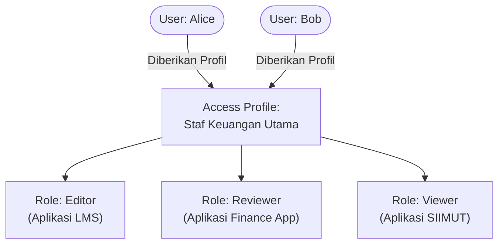

# Access Profiles (Role Bundles)

Di lingkungan perusahaan dengan banyak aplikasi internal, mengatur perizinan satu per satu akan sangat merepotkan. Misalnya, seorang pegawai baru di departemen Keuangan mungkin membutuhkan akses sebagai `editor` di aplikasi **LMS**, akses `reviewer` di aplikasi **Finance App**, dan akses `viewer` di aplikasi **SIIMUT**.

Untuk menyederhanakan proses ini, NexaID menggunakan fitur **Access Profiles** yang beroperasi layaknya *Role Bundles* (bundel peran).

## Konsep Dasar Access Profile

Secara teknis, sebuah **Access Profile** adalah semacam "keranjang" (grup) yang menampung sekumpulan **Role** yang ditarik dari berbagai **Aplikasi** yang berbeda. 

Ketika Anda menetapkan sebuah **Access Profile** kepada seorang pengguna (User), pengguna tersebut akan **secara otomatis mewarisi seluruh Role** yang ada di dalam keranjang profil tersebut ke setiap aplikasi kliennya.

### Keuntungan Menggunakan Access Profile:
1. **Pemberian Akses Cepat (*Onboarding*):** Saat karyawan baru masuk, admin tidak perlu mendaftarkan role karyawan tersebut satu per satu di setiap aplikasi. Cukup berikan mereka satu *Access Profile* yang merepresentasikan *job desc* mereka.
2. **Pencabutan Akses Terpusat (*Offboarding*):** Jika seorang karyawan pindah divisi, Anda hanya perlu mencabut *Access Profile* lamanya dan menggantinya dengan yang baru. Seluruh role di tiap aplikasi klien akan otomatis dicabut/disesuaikan oleh NexaID.
3. **Meminimalisir Kesalahan Manusia:** Menghindari insiden seperti *lupa* mencabut hak akses krusial seorang mantan karyawan di salah satu aplikasi lama.

---

## Arsitektur Data di NexaID

Berdasarkan *core* sistem NexaID, struktur relasinya dibangun sangat efisien:

1. **Aplikasi (`Application`)**: Data aplikasi klien yang didaftarkan di server NexaID (misal: LMS, IKP).
2. **Peran Aplikasi (`ApplicationRole`)**: Daftar peran spesifik yang valid untuk digunakan pada sebuah aplikasi (misal: `admin`, `teacher`, `student`).
3. **Profil Akses (`AccessProfile`)**: Bundel utamanya, yang memetakan banyak `ApplicationRole` dari aplikasi yang berbeda-beda (*Many-to-Many*).
4. **Relasi Pengguna (`UserAccessProfile`)**: Mengikat pengguna mana saja yang saat ini memegang `AccessProfile` tersebut.

::: info Direct Role Assignment
Meskipun NexaID sangat merekomendasikan penggunaan **Access Profile** untuk manajemen massal, sistem tetap mendukung fitur **Direct Role Assignment** (Penetapan *Role* secara langsung ke seorang *User* tanpa menggunakan profil) untuk penanganan kasus-kasus khusus/pengecualian.
:::

---

## Penanganan Multi-Role (Tumpang Tindih Profil)

Sangat mungkin terjadi kasus di mana seorang pengguna (User) diberikan lebih dari satu Access Profile, dan profil-profil tersebut memberikan **Role yang berbeda untuk satu aplikasi yang sama**. 

Misalnya:
* **Access Profile A** memberikan `role: admin` untuk Aplikasi X.
* **Access Profile B** memberikan `role: reviewer` untuk Aplikasi X.
* User "Budi" diberikan kedua Access Profile tersebut.

Bagaimana NexaID menanganinya?

1. **Di Sisi NexaID (Auth Server):** Sistem **tidak akan menolak atau saling menimpa** role tersebut. NexaID akan mengakomodir penumpukan ini dan secara sah menyatakan Budi memiliki kedua role tersebut untuk Aplikasi X. Saat proses *Single Sign-On (SSO)*, NexaID akan mengirimkan seluruh role tersebut dalam bentuk *array* (daftar).
2. **Di Sisi Aplikasi Klien:** Menjadi **tanggung jawab aplikasi klien** untuk "membaca" daftar role tersebut dan menggabungkan (*Union*) seluruh hak akses (*permissions*) yang dibawa oleh masing-masing role. 
    * Jika role `admin` membawa permission `[read, write]` dan role `reviewer` membawa permission `[verify]`, maka aplikasi klien harus mengevaluasi hak akses akhir Budi menjadi gabungan seluruhnya: `[read, write, verify]`.

Hal ini menegaskan prinsip *Separation of Concerns*: NexaID hanya bertugas mendistribusikan identitas dan daftar role secara valid, sementara aplikasi klien bertugas menjalankan evaluasi akhir otorisasi (logika bisnis).

---

## Penggunaan pada Dashboard

Untuk membuat dan mendistribusikan *Access Profile*, langkahnya sangat lugas:

1. **Buat Access Profile:** Navigasi ke menu *Access Profiles*, buat entri baru dan berikan nama yang representatif (contoh: "Akses Manajerial Keuangan").
2. **Kumpulkan Role:** Checklist/pilih role-role dari aplikasi mana saja yang akan dimasukkan ke dalam paket profil ini.
3. **Tetapkan Pengguna:** Pilih nama-nama pengguna yang berhak mendapatkan paket akses ini.

Sekali dikonfigurasi, NexaID akan mem-_push_ status akses dan peran baru ini ke aplikasi klien, sehingga pengguna langsung bisa login ke aplikasi-aplikasi tersebut dengan hak akses yang telah Anda tentukan.
