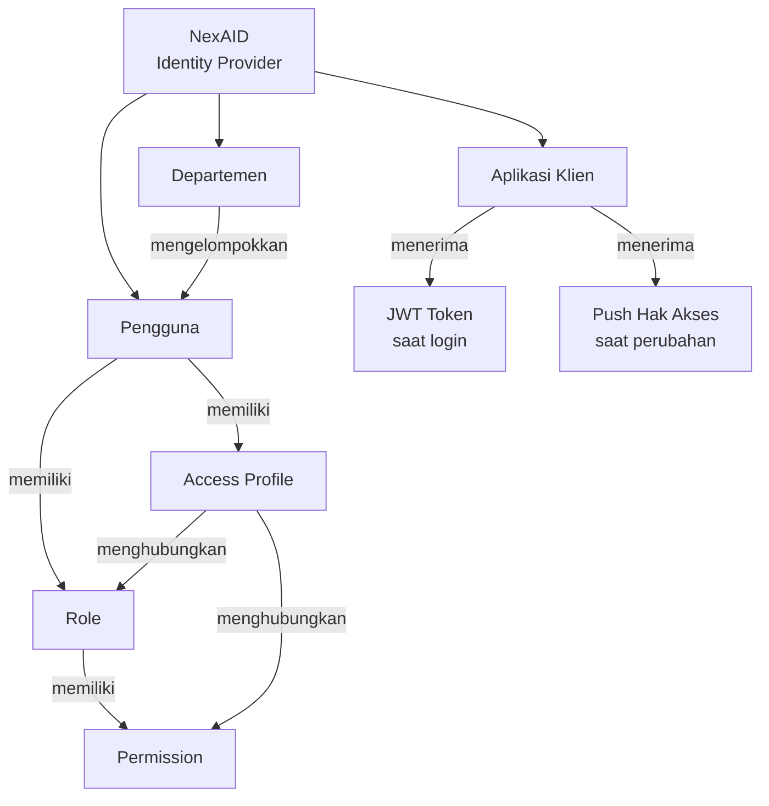

# Konsep Inti NexAID

Halaman ini menjelaskan konsep-konsep fundamental yang perlu dipahami sebelum menggunakan atau mengintegrasikan NexAID.

---

## Single Sign-On (SSO)

**Single Sign-On** adalah mekanisme di mana pengguna cukup **login satu kali** untuk mendapatkan akses ke semua aplikasi yang terhubung ke NexAID — tanpa perlu memasukkan kredensial berulang.

### Cara Kerja SSO di NexAID

1. Pengguna membuka aplikasi klien dan mengklik "Login".
2. Aplikasi klien mengarahkan pengguna ke halaman login **NexAID**.
3. Pengguna memasukkan kredensial di NexAID.
4. NexAID memverifikasi identitas dan menerbitkan **JWT token**.
5. Pengguna diarahkan kembali ke aplikasi klien dengan token tersebut.
6. Aplikasi klien memvalidasi token ke NexAID, lalu membuat sesi lokal.

::: tip Satu Sesi, Banyak Aplikasi
Jika pengguna sudah pernah login di NexAID dan sesinya masih aktif, saat membuka aplikasi klien lain mereka akan langsung diarahkan kembali dengan token baru — tanpa perlu login lagi.
:::

---

## Identity & Access Management (IAM)

IAM adalah sistem yang mengatur **siapa dapat mengakses apa**. Di NexAID, IAM mencakup:

### Pengguna (User)

Setiap anggota organisasi memiliki akun pengguna di NexAID. Data pengguna bersifat terpusat — perubahan profil, status, atau hak akses langsung berlaku di seluruh aplikasi klien yang terhubung.

### Role

**Role** adalah label jabatan atau fungsi yang diberikan kepada pengguna (misalnya: `admin`, `staff`, `manager`, `viewer`). Satu pengguna dapat memiliki lebih dari satu role.

```
Pengguna: Budi Santoso
Role    : staff, admin-keuangan
```

### Permission

**Permission** adalah izin akses spesifik terhadap suatu fitur atau resource (misalnya: `laporan.baca`, `pengguna.tambah`, `data.ekspor`). Permission ditetapkan secara granular dan dapat berbeda-beda per aplikasi klien.

### Access Profile

**Access Profile** adalah kumpulan (*bundle*) dari beberapa permission yang dikelompokkan menjadi satu profil akses. Access Profile memudahkan pemberian hak akses massal — cukup tetapkan satu profil ke pengguna, semua permission di dalamnya langsung berlaku.

```
Access Profile: "Staff Keuangan"
  └── laporan.baca
  └── laporan.ekspor
  └── anggaran.lihat
```

::: info Distribusi Otomatis
Setiap kali Access Profile diubah atau pengguna dipindahkan ke departemen lain, NexAID secara otomatis mendistribusikan pembaruan hak akses ke seluruh aplikasi klien yang terhubung.
:::

### Departemen

**Departemen** merepresentasikan unit organisasi (misalnya: Keuangan, HRD, IT). Pengelompokan ini digunakan untuk memudahkan manajemen pengguna dalam jumlah besar dan dapat menjadi dasar penetapan Access Profile secara massal.

---

## Aplikasi Klien

**Aplikasi Klien** adalah sistem atau aplikasi pihak ketiga yang telah didaftarkan dan terintegrasi ke NexAID. Setelah terdaftar, aplikasi klien:

- Mendelegasikan proses otentikasi pengguna ke NexAID.
- Menerima JWT token setelah login berhasil.
- Memperoleh data hak akses pengguna dari NexAID.

Setiap aplikasi klien memiliki **App Key** unik sebagai identitas saat berkomunikasi dengan NexAID.

---

## Token & Sesi

### JWT Token

**JWT (JSON Web Token)** adalah token terenkripsi yang diterbitkan NexAID setelah pengguna berhasil login. Token ini berisi:

- Identitas pengguna (ID, nama, email).
- Role dan permission yang dimiliki.
- Waktu kadaluarsa (*expiry time*).

JWT token digunakan oleh aplikasi klien untuk memverifikasi identitas pengguna tanpa harus menyimpan data sensitif secara lokal.

::: warning Penyimpanan Token
Simpan JWT token di **server-side session** atau **HttpOnly Cookie** — bukan di LocalStorage. LocalStorage rentan terhadap serangan XSS (*Cross-Site Scripting*).
:::

### Sesi NexAID vs Sesi Lokal

| Aspek | Sesi NexAID | Sesi Lokal (Aplikasi Klien) |
|-------|------------|----------------------------|
| Dikelola oleh | NexAID | Aplikasi klien |
| Scope | Semua aplikasi klien | Hanya aplikasi tersebut |
| Berakhir saat | Logout global / timeout | Logout lokal / timeout |
| Efek logout | Semua aplikasi terputus | Hanya aplikasi ini |

### Validasi Token

Aplikasi klien harus memvalidasi token yang diterima ke endpoint NexAID sebelum membuat sesi lokal:

```http
POST /api/auth/session-from-token
Authorization: Bearer {JWT_TOKEN}
```

---

## Ringkasan Hubungan Konsep



Dengan memahami konsep-konsep ini, Anda siap untuk mengeksplorasi:

- 🔐 [Alur SSO](../sso/flow) — detail teknis proses login SSO.
- 👥 [Manajemen IAM](../iam/) — cara mengelola pengguna, role, dan permission.
- 🔌 [API Reference](../api/) — endpoint lengkap untuk integrasi.
