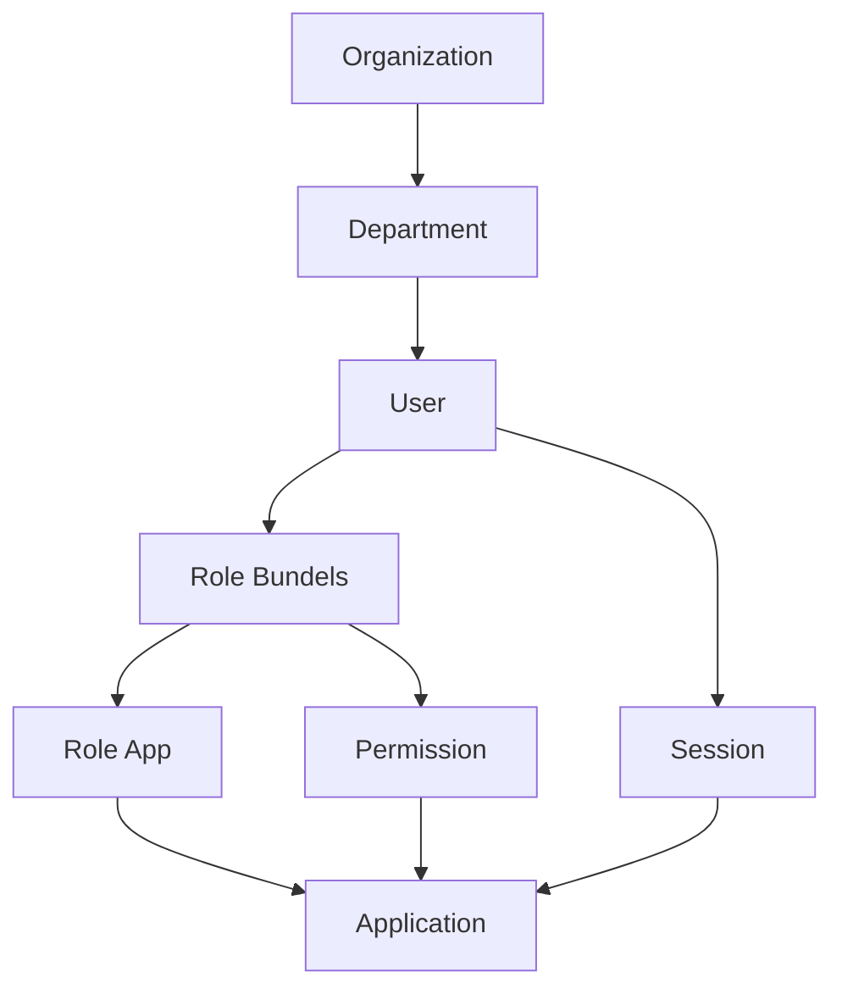
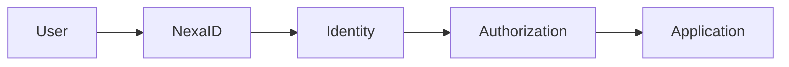

# Konsep Inti

Sebelum menggunakan atau mengintegrasikan NexaID, penting untuk memahami beberapa konsep dasar yang menjadi fondasi seluruh fitur di dalam platform ini.

NexaID memisahkan tanggung jawab antara **identitas pengguna**, **autentikasi**, **otorisasi**, dan **aplikasi** sehingga setiap komponen memiliki peran yang jelas serta dapat digunakan bersama oleh seluruh aplikasi dalam organisasi.

## Gambaran Umum

Diagram berikut menunjukkan hubungan antar komponen utama di dalam NexaID.

## Identity

Identity merepresentasikan informasi utama yang digunakan untuk mengenali seorang pengguna di seluruh aplikasi.

Di NexaID, setiap pengguna hanya memiliki satu identitas yang digunakan bersama oleh seluruh aplikasi yang terintegrasi. Informasi seperti nama, email, NIP, status akun, jabatan, maupun unit kerja dikelola secara terpusat sehingga perubahan data tidak perlu dilakukan pada setiap aplikasi secara terpisah.

## Authentication

Authentication adalah proses memverifikasi identitas pengguna sebelum akses diberikan.

NexaID bertindak sebagai **Identity Provider (IdP)** yang menangani proses autentikasi melalui **Single Sign-On (SSO)**. Setelah pengguna berhasil login, aplikasi tidak lagi melakukan autentikasi sendiri, tetapi mempercayakan hasil autentikasi tersebut kepada NexaID.

Dengan pendekatan ini, pengguna hanya perlu melakukan login satu kali untuk mengakses beberapa aplikasi yang telah terhubung.

## Authorization

Authorization menentukan sumber daya (*resource*) apa saja yang dapat diakses oleh pengguna setelah berhasil diautentikasi.

NexaID menggunakan tiga komponen utama untuk mengelola hak akses.

| Komponen | Fungsi |
|----------|--------|
| **Role** | Merepresentasikan fungsi atau tanggung jawab pengguna di dalam aplikasi. |
| **Permission** | Mendefinisikan izin terhadap fitur atau resource tertentu. |
| **Access Profile** | Mengelompokkan Role dan Permission sehingga hak akses dapat diberikan secara lebih mudah dan konsisten. |

Dengan pendekatan tersebut, administrator tidak perlu memberikan permission satu per satu kepada setiap pengguna.

## Organization

Organization digunakan untuk memodelkan struktur organisasi di dalam perusahaan atau instansi.

Komponen ini biasanya terdiri atas:

- Organization
- Department
- Unit Kerja
- Job Position

Struktur organisasi dapat digunakan sebagai dasar pengelompokan pengguna maupun pemberian hak akses sesuai kebutuhan organisasi.

## Application

Application adalah sistem yang mempercayakan proses autentikasi kepada NexaID.

Setiap aplikasi yang ingin menggunakan layanan Single Sign-On harus didaftarkan terlebih dahulu sehingga memperoleh identitas aplikasi (*App Key*) dan konfigurasi autentikasi yang diperlukan.

Setelah terdaftar, aplikasi dapat menggunakan NexaID sebagai pusat autentikasi tanpa perlu membangun sistem login sendiri.

## Session

Session merepresentasikan status autentikasi pengguna setelah berhasil login.

Pada implementasi NexaID terdapat dua jenis sesi.

| Session | Dikelola Oleh |
|----------|---------------|
| **NexaID Session** | NexaID |
| **Application Session** | Aplikasi Klien |

Session NexaID digunakan untuk mempertahankan status login pengguna di seluruh aplikasi, sedangkan aplikasi klien tetap memiliki session lokal yang digunakan untuk kebutuhan internal aplikasi tersebut.

## Hubungan Antar Konsep

Secara sederhana, alur kerja NexaID dapat digambarkan sebagai berikut.

1. Pengguna melakukan autentikasi melalui NexaID.
2. NexaID memverifikasi identitas pengguna.
3. NexaID menentukan hak akses berdasarkan Organization, Role, Permission, dan Access Profile.
4. Aplikasi menerima identitas pengguna beserta informasi hak akses.
5. Aplikasi menggunakan informasi tersebut untuk menentukan fitur yang dapat diakses oleh pengguna.

Diagram berikut menggambarkan alur tersebut.

## Ringkasan

NexaID dibangun di atas beberapa konsep utama yang saling berkaitan.

- **Identity** menyimpan identitas pengguna secara terpusat.
- **Authentication** memverifikasi identitas melalui Single Sign-On.
- **Authorization** menentukan hak akses berdasarkan Role, Permission, dan Access Profile.
- **Organization** mengelola struktur organisasi.
- **Application** menggunakan NexaID sebagai Identity Provider.
- **Session** mempertahankan status autentikasi pengguna.

Memahami konsep-konsep tersebut akan memudahkan Anda dalam mengelola pengguna, mengintegrasikan aplikasi, maupun memahami alur autentikasi yang digunakan oleh NexaID.

::: info Langkah Selanjutnya

Selanjutnya Anda dapat mempelajari dokumentasi berikut sesuai kebutuhan.

- **Organizations** — Memahami struktur organisasi dan unit kerja.
- **Users** — Mengelola identitas pengguna.
- **Applications** — Mendaftarkan aplikasi ke NexaID.
- **Single Sign-On** — Mempelajari alur autentikasi secara teknis.
- **Sessions** — Memahami pengelolaan sesi pengguna.