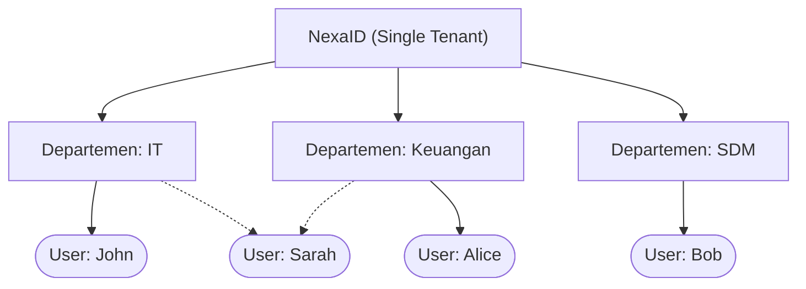

# Organizations & Departemen

Struktur organisasi dalam ekosistem NexaID dirancang dengan pendekatan yang sangat **sederhana dan lugas (flat)**. Alih-alih menggunakan hierarki kompleks yang bertingkat-tingkat (seperti Tenant > Department > Division > Team), NexaID berfokus pada pengelompokan pengguna menggunakan entitas tunggal yaitu **Departemen**.

Pendekatan ini sengaja dipilih untuk memberikan fleksibilitas tinggi dan mempermudah sinkronisasi dengan aplikasi-aplikasi klien (seperti *SIIMUT*, *IKP*, *LMS*) tanpa menambah beban administrasi.

---

## Konsep Dasar "Departemen"

**Departemen** adalah representasi tunggal dari sebuah departemen, tim, divisi, cabang, atau unit bisnis di organisasi Anda. 

### Karakteristik Struktur NexaID:
1. **Tidak Ada Hierarki Bersarang:** Semua Departemen berdiri sejajar di level yang sama. Tidak ada sub-unit atau parent-unit.
2. **Penamaan Bebas:** Anda dapat menamai Departemen sebagai nama divisi (misal: "Keuangan") maupun sebagai nama peran tim spesifik (misal: "Tim Backend").

---

## User Membership (Keanggotaan)

Satu akun pengguna (User) di NexaID dapat menjadi anggota di **satu atau lebih Departemen** secara bersamaan. Hubungan *Many-to-Many* ini sangat berguna ketika seorang karyawan memegang tanggung jawab lintas departemen.

**Contoh Kasus:**
Sarah adalah seorang manajer yang mengawasi operasional IT dan mengevaluasi tagihan di Keuangan. Maka, di dashboard NexaID, Sarah dapat diatur agar tergabung ke dalam dua Departemen sekaligus:
- `[x]` Departemen: IT
- `[x]` Departemen: Keuangan

Perubahan anggota di Departemen NexaID ini akan langsung disinkronisasi ke seluruh aplikasi klien yang terhubung ke NexaID, sehingga aplikasi klien langsung mengerti di departemen mana pengguna tersebut bernaung saat *login*.

---

## Fungsi Utama Departemen

Pengelompokan menggunakan Departemen di NexaID utamanya ditujukan untuk:

- **Pengelompokan Data:** Memudahkan aplikasi klien memfilter data saat menampilkan informasi (misal: "tampilkan seluruh laporan milik pengguna di Departemen SDM").
- **Reporting & Statistik:** Membantu pembuatan rekapitulasi data berdasarkan pengelompokan unit.
- **Identitas Distribusi:** Mengetahui dengan jelas asal divisi atau penempatan kerja setiap pegawai dari pusat secara tersinkronisasi.

::: info Role vs Departemen
Departemen **bukanlah** penentu hak akses atau perizinan (Permission) spesifik di dalam aplikasi klien.
Jika Anda ingin mengatur izin fitur (contoh: Siapa yang boleh klik tombol *Hapus* atau menu *Dashboard Admin*), gunakan pengaturan **Roles** dan **Access Profiles**, bukan sekadar berpatokan pada Departemen.
:::

---

## Manajemen di Dashboard

Mengelola Departemen di NexaID sangat mudah dan cepat:
1. Masuk ke menu **Departemen**.
2. Klik tombol untuk **Tambah Departemen**.
3. Cukup isi nama unit (contoh: "Pusat Data") dan tambahkan deskripsi (opsional).
4. Selesai! Anda kini bisa menetapkan/mendaftarkan pengguna ke dalam Departemen tersebut.