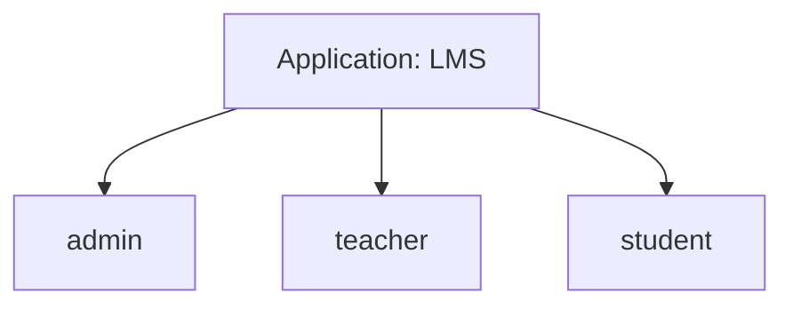
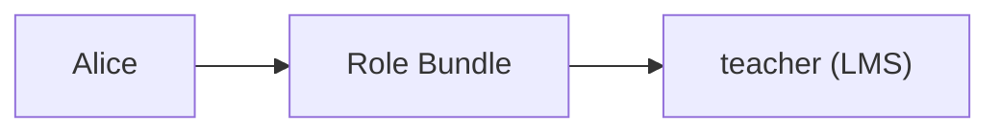

---

title: Roles
description: Dokumentasi mengenai Role pada NexaID sebagai representasi hak akses pengguna untuk setiap aplikasi klien.
-----------------------------------------------------------------------------------------------------------------------

# Roles

Role merupakan mekanisme utama yang digunakan NexaID untuk menentukan hak akses pengguna pada sebuah aplikasi klien. Setiap aplikasi mendefinisikan daftar role yang dimilikinya, kemudian NexaID mendistribusikan role tersebut kepada pengguna melalui **Role Bundle** atau penugasan langsung.

NexaID **tidak mengelola permission**. Detail hak akses di dalam aplikasi sepenuhnya menjadi tanggung jawab aplikasi klien.

---

## Konsep Dasar

Role selalu dimiliki oleh sebuah aplikasi.



Role tersebut kemudian dapat diberikan kepada user.



Saat pengguna melakukan login melalui NexaID, aplikasi akan menerima daftar role yang dimiliki pengguna untuk aplikasi tersebut.

---

## Role per Application

Setiap aplikasi memiliki kumpulan role yang berbeda.

| Application | Roles                     |
| ----------- | ------------------------- |
| LMS         | admin, teacher, student   |
| Finance     | admin, reviewer, approver |
| Inventory   | admin, operator, viewer   |

Role pada satu aplikasi tidak memiliki hubungan dengan role pada aplikasi lainnya.

---

## Tanggung Jawab NexaID

NexaID bertanggung jawab untuk:

* Menyimpan daftar role setiap aplikasi.
* Memberikan role kepada user.
* Mengelompokkan role menggunakan **Role Bundle**.
* Mengirim informasi role kepada aplikasi setelah proses autentikasi.

NexaID **tidak menentukan** apa yang boleh dilakukan oleh role tersebut di dalam aplikasi.

---

## Permission Dikelola oleh Aplikasi

NexaID tidak mengenal konsep permission seperti:

```text
user.create
user.update
user.delete
```

Apabila aplikasi membutuhkan kontrol akses yang lebih detail, permission harus dikelola oleh aplikasi tersebut.

Sebagai contoh:

```text
NexaID
└── Role: teacher

↓

LMS

teacher
├── Create Course
├── Upload Material
├── View Students
└── Grade Assignment
```

Dengan pendekatan ini, NexaID tetap berperan sebagai penyedia identitas dan role, sedangkan logika otorisasi tetap berada di dalam aplikasi klien.

---

## Best Practices

* Definisikan role berdasarkan kebutuhan bisnis aplikasi.
* Gunakan nama role yang konsisten seperti `admin`, `manager`, `staff`, atau `viewer`.
* Distribusikan role menggunakan **Role Bundle** apabila digunakan oleh banyak pengguna.
* Implementasikan permission dan kebijakan otorisasi di aplikasi klien, bukan di NexaID.

---

## Ringkasan

Role adalah satu-satunya mekanisme otorisasi yang dikelola oleh NexaID. Setelah proses autentikasi berhasil, NexaID mengirimkan role pengguna kepada aplikasi klien. Seluruh aturan mengenai permission, kebijakan akses, dan tindakan yang diizinkan berdasarkan role tersebut sepenuhnya diimplementasikan oleh aplikasi klien.
