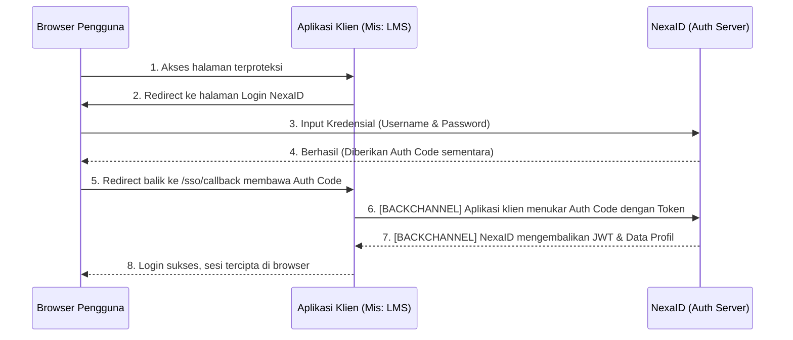

# Single Sign-On (SSO) Flow

NexaID menggunakan standar otentikasi industri yang sangat aman. Proses pertukaran otentikasi ini melibatkan komunikasi dua arah yang terpisah antara **Browser Pengguna (Front-Channel)** dan **Komunikasi Antar Server (Back-Channel)**.

---

## Alur Dasar Otentikasi

Demi menjaga keamanan, *Access Token* rahasia tidak boleh terekspos secara langsung di *browser* pengguna (seperti di URL). Berikut adalah alur pertukaran yang digunakan oleh NexaID:



---

## Front-Channel vs Back-Channel (Solusi Isu Docker)

Dalam lingkungan *microservices*, terutama jika Anda mendeploy aplikasi menggunakan **Docker Network**, Anda akan sering menemui isu jaringan yang disebut **Hairpin NAT**. Isu ini terjadi ketika *container* mencoba memanggil nama domain publik miliknya sendiri, namun gagal menemukan jalannya kembali.

Di sinilah letak perbedaan dan fungsi krusial antara Front-Channel dan Back-Channel di NexaID:

### 1. Front-Channel (Komunikasi Browser)
Ini adalah URL eksternal yang diakses oleh manusia (*browser*).
- **Contoh URL:** `https://auth.perusahaan.com`
- **Fungsi:** Digunakan untuk menampilkan antarmuka grafis (UI) halaman login dan memantulkan (*redirect*) pengguna antara aplikasi klien dan server NexaID. Komunikasi ini berjalan melintasi *public internet* (via Reverse Proxy).

### 2. Back-Channel (Server-to-Server)
Ini adalah jalur API internal di mana *backend* kode aplikasi Anda (misalnya Laravel/PHP) berkomunikasi langsung dengan *backend* NexaID di belakang layar, tanpa melibatkan *browser*.
- **Masalah:** Jika *backend* klien mencoba memanggil `https://auth.perusahaan.com/api/...` untuk menukar token, *request* tersebut akan "keluar" dari Docker Network ke internet, lalu terblokir atau *timeout* saat mencoba masuk kembali (Hairpin NAT).
- **Solusi NexaID:** Anda dapat memerintahkan *backend* klien untuk menggunakan jalur **Backchannel** dengan menembak nama *container* / DNS internal Docker milik NexaID secara langsung (contoh: `http://auth-server-container:8000`). Komunikasi lintas *container* ini sangat cepat, andal, dan kebal terhadap masalah NAT/DNS eksternal.

```mermaid
graph TD
    User([Browser Pengguna])
    
    subgraph Docker Network Internal
        Proxy[Nginx / Traefik<br/>(Public Gateway)]
        Klien[Container:<br/>Aplikasi Klien]
        NexaID[Container:<br/>NexaID Auth Server]
    end
    
    User -- "Front-channel (Internet)" --> Proxy
    Proxy --> Klien
    Proxy --> NexaID
    
    Klien -- "Back-channel (Bypass Internet via DNS Docker)" --> NexaID
```

---

## Penerapan di Aplikasi Klien (`.env`)

Untuk mengatasi masalah jaringan di atas, *developer* aplikasi klien cukup mengkonfigurasi file `.env` mereka dengan memisahkan domain publik dan nama *host internal* Docker-nya:

```env
# URL yang diakses via BROWSER / Internet (Front-channel)
IAM_HOST=https://auth.perusahaan.com

# URL yang diakses via BACKEND SERVER (Back-channel Internal Docker)
IAM_BACKCHANNEL=http://auth-server:8000
```

Dengan pemisahan dua entitas ini, proses otentikasi akan selalu berhasil (*reliable*) di *environment* apapun, sekaligus menjaga pertukaran data token tetap 100% rahasia di dalam jaringan tertutup (VPN/VPC/Docker Network) milik Anda.
