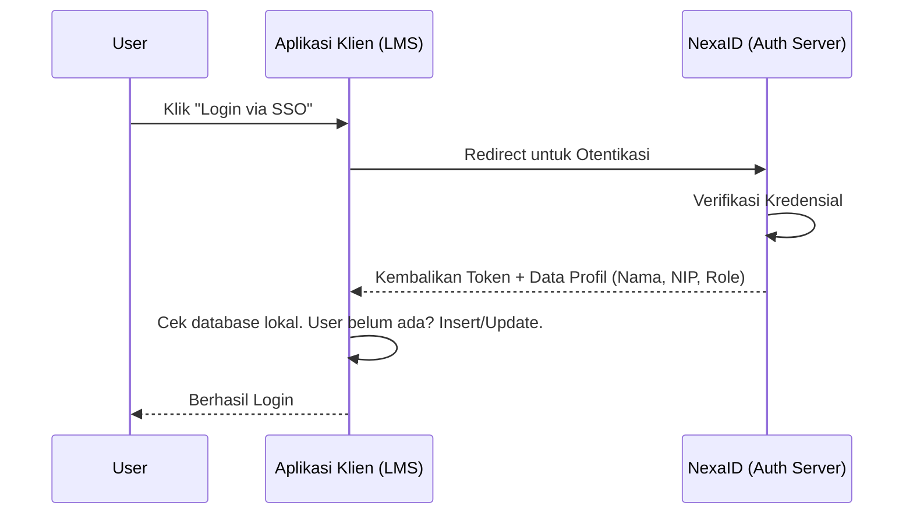

# Users & Data Identitas

Pengguna (*User*) di dalam NexaID adalah representasi dari identitas karyawan, staf, atau pihak manapun yang berhak mengakses ekosistem digital perusahaan Anda. 

NexaID bertindak sebagai **Single Source of Truth (SSOT)** atau pusat kebenaran tunggal bagi manajemen pengguna. Pembuatan akun, pengubahan *password*, hingga pemblokiran (*suspend*) akun semuanya dilakukan terpusat melalui satu pintu di NexaID.

---

## Mengapa Aplikasi Klien Masih Memiliki Tabel `users`?

Pertanyaan yang sering muncul dari *developer* saat integrasi adalah: 
> *"Jika semua data pengguna sudah dikelola secara terpusat oleh IAM (NexaID), mengapa aplikasi klien (seperti LMS atau HRIS) masih harus memiliki model dan tabel `users` di database lokalnya masing-masing?"*

Alasannya sangat fundamental:

1. **Pemisahan Fisik (*Separation of Concerns*)**
   Database server IAM (NexaID) dan database aplikasi klien terpisah secara fisik. Aplikasi klien dirancang agar tetap bisa memproses relasi bisnis secara mandiri.
2. **Kebutuhan Relasi Lokal (*Foreign Keys*)**
   Aplikasi klien membutuhkan tabel `users` lokal untuk dihubungkan dengan data transaksional mereka. Contoh: Di aplikasi LMS, data `sertifikat_id` harus berelasi dengan `user_id`. Melakukan *JOIN query* lintas database ke server IAM secara *real-time* untuk setiap halaman akan sangat membebani performa sistem.

---

## Mekanisme Sinkronisasi Cerdas (*Smart Sync*)

Meskipun tabel berada di database yang berbeda, NexaID memastikan data pengguna selalu mutakhir dan **tersinkronisasi secara presisi**.

NexaID tidak melakukan _dump_ (membuang paksa seluruh data 300 orang ke semua aplikasi), melainkan menggunakan sistem **Just-In-Time (JIT) Provisioning** dan *Push Sync*. Data di aplikasi klien hanya akan dibuat/diperbarui pada saat pertukaran token SSO terjadi (saat *login*), atau ketika admin mengubah Role/Access Profile pengguna dari dashboard NexaID.

---

## Efisiensi Skala Data (Studi Kasus 300 vs 30)

Selain demi menjaga performa, model sinkronisasi ini juga dirancang untuk **keamanan privasi** dan **efisiensi data**.

Mari ambil contoh nyata:
- Perusahaan Anda memiliki total **300 karyawan** yang datanya tersimpan di pusat (NexaID).
- Terdapat sebuah aplikasi klien, misalnya **Aplikasi Kasir**, yang hak aksesnya hanya diberikan kepada **30 orang** spesifik melalui pengaturan *Access Profile*.

Dalam skenario ini:
**Database lokal Aplikasi Kasir HANYA akan berisi 30 data pengguna tersebut, BUKAN 300 pengguna!** 

### Keuntungan Pendekatan Ini:
1. **Database Klien Tetap Ramping:** Aplikasi tidak dipenuhi oleh "data hantu" (pengguna yang tidak pernah, dan tidak berhak, mengakses aplikasi tersebut).
2. **Keamanan Maksimal:** Identitas dan profil 270 karyawan lainnya tidak akan pernah terekspos / bocor ke dalam database Aplikasi Kasir, mematuhi prinsip keamanan *Least Privilege*.
3. **Penghapusan Akses yang Bersih:** Jika salah satu dari 30 orang tadi dicabut aksesnya dari NexaID (misalnya di-*suspend* atau *resign*), maka ketika orang tersebut mencoba masuk, aksesnya tertolak dari gerbang depan (NexaID). Data lokal di Aplikasi Kasir tetap aman dan historis relasi datanya tidak rusak.
