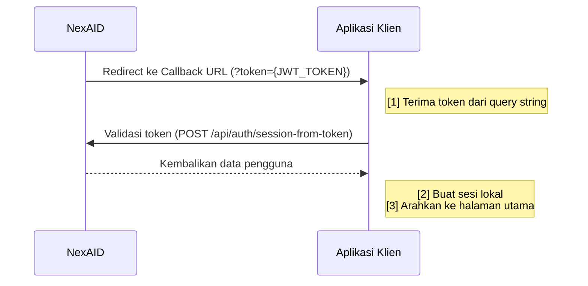

# Callback & Validasi Token

Setelah pengguna berhasil login di NexAID, browser secara otomatis diarahkan kembali ke **Callback URL** aplikasi klien beserta JWT token. Halaman ini menjelaskan cara menerima, memvalidasi, dan menggunakan token tersebut.

---

## Apa Itu Callback URL?

**Callback URL** adalah endpoint di aplikasi klien yang telah didaftarkan ke NexAID. Setelah pengguna berhasil login, NexAID melakukan **redirect** ke URL ini dengan menyertakan JWT token sebagai query parameter.

Callback URL harus:
- Terdaftar di NexAID Admin Panel (redirect ke URL yang tidak terdaftar akan diblokir).
- Dapat diakses dari internet (tidak boleh `localhost` di produksi).
- Menggunakan **HTTPS** di lingkungan produksi.

::: tip Mendaftarkan Callback URL
Callback URL didaftarkan saat Anda mendaftarkan aplikasi di **NexAID Admin Panel → Applications → [Nama Aplikasi] → Edit**. Anda dapat mendaftarkan lebih dari satu Callback URL jika diperlukan (misalnya untuk staging dan produksi).
:::

---

## Alur Setelah Login Berhasil



---

## Menerima Token di Callback

NexAID akan melakukan redirect ke Callback URL dengan format berikut:

```
GET https://myapp.example.com/auth/callback?token={JWT_TOKEN}
```

Di endpoint callback aplikasi klien, ambil nilai `token` dari query string:

::: code-group

```php [PHP]
<?php
// Route: GET /auth/callback

$token = $_GET['token'] ?? null;

if (!$token) {
    // Token tidak ada — arahkan ke halaman error atau login
    header("Location: /login?error=token_missing");
    exit;
}

// Lanjut validasi token ke NexAID...
```

```javascript [Node.js / Express]
// Route: GET /auth/callback
app.get('/auth/callback', async (req, res) => {
  const token = req.query.token;

  if (!token) {
    return res.redirect('/login?error=token_missing');
  }

  // Lanjut validasi token ke NexAID...
});
```

```python [Python / Flask]
from flask import request, redirect

@app.route('/auth/callback')
def callback():
    token = request.args.get('token')

    if not token:
        return redirect('/login?error=token_missing')

    # Lanjut validasi token ke NexAID...
```

:::

---

## Validasi Token ke NexAID

::: warning Validasi Wajib Dilakukan
Meskipun JWT token dapat di-decode secara lokal, **selalu validasikan token ke NexAID** untuk memastikan token masih aktif, belum dicabut (*revoked*), dan berasal dari sumber yang sah.
:::

### Endpoint Validasi

```http
POST /api/auth/session-from-token
Authorization: Bearer {JWT_TOKEN}
Content-Type: application/json
```

**URL Lengkap:**
```
POST https://nexaid.example.com/api/auth/session-from-token
```

### Contoh Request

::: code-group

```php [PHP]
$ch = curl_init();
curl_setopt_array($ch, [
    CURLOPT_URL            => getenv('NEXAID_SSO_URL') . '/api/auth/session-from-token',
    CURLOPT_POST           => true,
    CURLOPT_RETURNTRANSFER => true,
    CURLOPT_HTTPHEADER     => [
        'Authorization: Bearer ' . $token,
        'Content-Type: application/json',
        'Accept: application/json',
    ],
]);

$response = curl_exec($ch);
$data     = json_decode($response, true);
curl_close($ch);

if ($data['status'] === true) {
    $user = $data['data']['user'];
    // Buat sesi lokal dengan $user
} else {
    // Token tidak valid
    header("Location: /login?error=invalid_token");
    exit;
}
```

```javascript [Node.js (axios)]
const axios = require('axios');

const response = await axios.post(
  `${process.env.NEXAID_SSO_URL}/api/auth/session-from-token`,
  {},
  {
    headers: {
      Authorization: `Bearer ${token}`,
      'Content-Type': 'application/json',
      Accept: 'application/json',
    },
  }
);

if (response.data.status === true) {
  const user = response.data.data.user;
  // Buat sesi lokal dengan user
} else {
  res.redirect('/login?error=invalid_token');
}
```

```python [Python (requests)]
import requests

response = requests.post(
    f"{os.getenv('NEXAID_SSO_URL')}/api/auth/session-from-token",
    headers={
        'Authorization': f'Bearer {token}',
        'Content-Type': 'application/json',
        'Accept': 'application/json',
    }
)

data = response.json()
if data.get('status') is True:
    user = data['data']['user']
    # Buat sesi lokal dengan user
else:
    return redirect('/login?error=invalid_token')
```

:::

---

## Struktur Respons

### Sukses (`200 OK`)

```json
{
  "status": true,
  "message": "Token valid",
  "data": {
    "user": {
      "id": 42,
      "name": "Dewi Rahayu",
      "email": "dewi@example.com",
      "username": "dewi.rahayu",
      "department": "Keuangan",
      "roles": ["staff", "manager-keuangan"],
      "permissions": [
        "laporan.baca",
        "laporan.ekspor",
        "anggaran.lihat"
      ]
    }
  }
}
```

### Token Tidak Valid (`401 Unauthorized`)

```json
{
  "status": false,
  "message": "Token tidak valid atau sudah kadaluarsa"
}
```

### Token Dicabut / Pengguna Tidak Aktif (`403 Forbidden`)

```json
{
  "status": false,
  "message": "Akses ditolak. Pengguna tidak aktif."
}
```

---

## Membuat Sesi Lokal

Setelah validasi berhasil, gunakan data `user` dari respons NexAID untuk membuat sesi lokal di aplikasi klien:

```php
// Contoh membuat sesi di PHP
session_start();
$_SESSION['user_id']     = $user['id'];
$_SESSION['user_name']   = $user['name'];
$_SESSION['user_email']  = $user['email'];
$_SESSION['user_roles']  = $user['roles'];
$_SESSION['nexaid_token'] = $token; // Simpan token untuk keperluan API calls

// Arahkan ke halaman utama aplikasi
header("Location: /dashboard");
exit;
```

::: tip Simpan Token dengan Aman
Simpan JWT token di **server-side session** atau sebagai **HttpOnly Cookie** — bukan di LocalStorage. HttpOnly Cookie tidak dapat diakses oleh JavaScript, sehingga aman dari serangan XSS.
:::

---

## Penanganan Error

| Kode Error | Penyebab | Tindakan yang Disarankan |
|-----------|---------|--------------------------|
| Token kosong / tidak ada di query string | Pengguna membatalkan login, atau terjadi error di NexAID | Arahkan ke halaman login, tampilkan pesan informatif |
| `401 Unauthorized` | Token kadaluarsa atau format salah | Arahkan pengguna ke alur login ulang |
| `403 Forbidden` | Pengguna tidak aktif atau akses dicabut | Tampilkan pesan "Akses Ditolak", hubungi administrator |
| `404 Not Found` | URL endpoint salah | Periksa konfigurasi `NEXAID_SSO_URL` |
| Network timeout | NexAID tidak dapat dijangkau | Tampilkan pesan error dan retry |
| Token dimanipulasi | Token diubah sebelum sampai ke callback | Tolak, catat log keamanan, minta login ulang |

---

## Langkah Berikutnya

- 🚪 [Logout SSO](./logout) — cara mengakhiri sesi lokal dan global SSO.
- 👥 [Manajemen IAM](../iam/) — memahami role dan permission yang ada di data token.
- 🔌 [API Reference](../api/) — dokumentasi lengkap semua endpoint NexAID.
