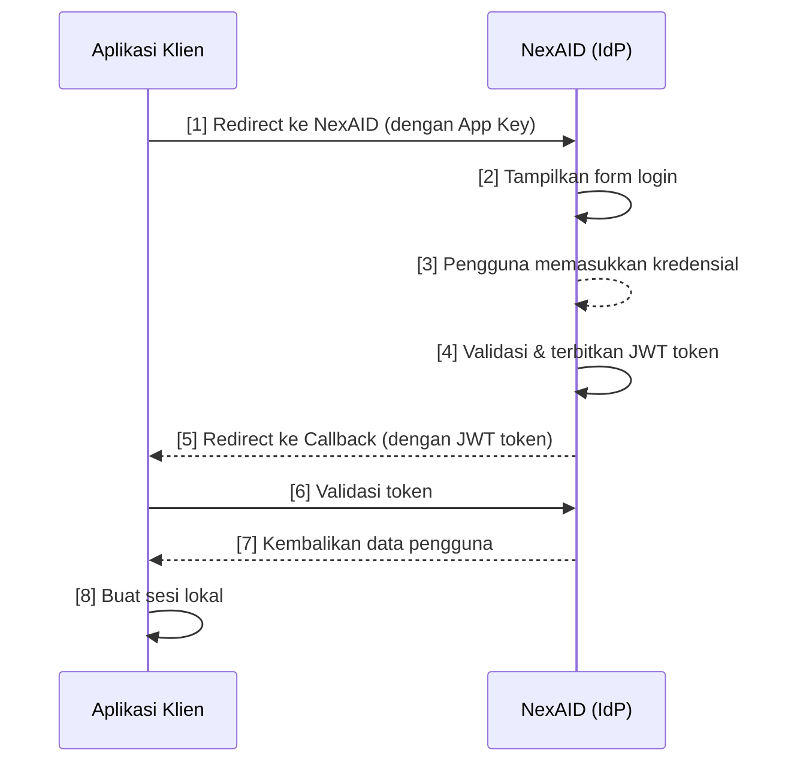

# Alur Single Sign-On (SSO)

Halaman ini menjelaskan alur SSO NexAID secara lengkap dari sudut pandang **developer yang mengintegrasikan aplikasi klien**. Memahami alur ini penting sebelum melakukan implementasi.

---

## Gambaran Umum Alur

Alur SSO NexAID mengikuti pola *redirect-based authentication*:



---

## Langkah-Langkah Alur SSO

### Langkah 1: Inisiasi Login (Redirect ke NexAID)

Ketika pengguna mengklik tombol "Login" di aplikasi klien, aplikasi **mengarahkan (*redirect*) pengguna** ke halaman login NexAID dengan menyertakan App Key sebagai parameter.

**Format URL redirect:**

```
GET https://nexaid.example.com/login?app_key={APP_KEY}
```

**Parameter:**

| Parameter | Wajib | Keterangan |
|-----------|-------|-----------|
| `app_key` | ✅ Ya | App Key unik aplikasi klien, didapat dari NexAID Admin |

::: tip
App Key digunakan NexAID untuk mengenali aplikasi mana yang meminta login, sehingga NexAID dapat mengarahkan pengguna ke Callback URL yang benar setelah login berhasil.
:::

---

### Langkah 2: Pengguna Login di NexAID

NexAID menampilkan halaman login. Pengguna memasukkan kredensial (username/email dan password).

Pada tahap ini, ada dua kondisi yang bisa terjadi:

- **Pengguna sudah memiliki sesi aktif di NexAID** → Pengguna tidak perlu login lagi. NexAID langsung menerbitkan token baru dan meneruskan ke Langkah 5.
- **Pengguna belum login** → Pengguna mengisi form login terlebih dahulu.

::: info
Inilah inti dari pengalaman SSO — pengguna yang sudah login di aplikasi lain tidak perlu memasukkan kredensial lagi.
:::

---

### Langkah 3: NexAID Memverifikasi Identitas

NexAID memvalidasi kredensial yang diberikan. Jika valid:

- Sesi NexAID dibuat atau diperbarui untuk pengguna tersebut.
- NexAID menerbitkan **JWT Token** yang berisi data identitas dan hak akses pengguna.

Jika tidak valid, NexAID menampilkan pesan error di halaman login — pengguna tidak akan diarahkan ke aplikasi klien.

---

### Langkah 4: Token Exchange & Callback

Setelah login berhasil, NexAID **mengarahkan pengguna kembali ke Callback URL** aplikasi klien dengan JWT token sebagai query parameter:

```
GET https://myapp.example.com/auth/callback?token={JWT_TOKEN}
```

Aplikasi klien menerima token ini di endpoint callback yang sudah disiapkan.

---

### Langkah 5: Validasi Token oleh Aplikasi Klien

Aplikasi klien **wajib memvalidasi** token yang diterima ke NexAID sebelum membuat sesi lokal. Validasi dilakukan dengan memanggil endpoint:

```http
POST /api/auth/session-from-token
Authorization: Bearer {JWT_TOKEN}
Content-Type: application/json
```

**Respons sukses (`200 OK`):**

```json
{
  "status": true,
  "message": "Token valid",
  "data": {
    "user": {
      "id": 42,
      "name": "Dewi Rahayu",
      "email": "dewi@example.com",
      "roles": ["staff", "manager-ops"],
      "permissions": ["laporan.baca", "data.ekspor"]
    }
  }
}
```

::: warning Jangan Percaya Token Tanpa Validasi
Meskipun JWT dapat di-decode secara lokal, selalu validasikan token ke NexAID untuk memastikan token belum dicabut (*revoked*) atau kadaluarsa.
:::

---

### Langkah 6: Buat Sesi Lokal

Setelah token divalidasi dan data pengguna diterima, aplikasi klien membuat sesi lokal menggunakan data tersebut. Pengguna sekarang dianggap terautentikasi di aplikasi klien.

---

## Best Practice Keamanan

### Penyimpanan Token

::: danger Jangan Simpan Token di LocalStorage
LocalStorage dapat dibaca oleh JavaScript dari domain mana pun jika terjadi serangan XSS. Simpan JWT token di:
- **HttpOnly Cookie** (direkomendasikan) — tidak dapat diakses oleh JavaScript.
- **Server-side session** — token disimpan di server, hanya session ID yang dikirim ke browser.
:::

### HTTPS Wajib

::: warning Gunakan HTTPS
Semua komunikasi antara aplikasi klien dan NexAID **harus menggunakan HTTPS**. Jangan pernah melakukan redirect atau pertukaran token melalui HTTP biasa di lingkungan produksi.
:::

### Validasi Callback URL

::: tip
Selalu daftarkan Callback URL yang spesifik di NexAID Admin. NexAID hanya akan melakukan redirect ke URL yang sudah terdaftar, mencegah serangan *open redirect*.
:::

### Batas Waktu Token

JWT token NexAID memiliki masa berlaku terbatas. Jika token sudah kadaluarsa:

1. Minta pengguna untuk login ulang melalui alur SSO.
2. Jangan coba memperpanjang token secara manual tanpa melalui alur autentikasi ulang.

---

## Penanganan Error

| Error | Penyebab | Tindakan |
|-------|---------|---------|
| Tidak ada `token` di callback | Login gagal atau dibatalkan | Arahkan pengguna ke halaman login |
| `401 Unauthorized` saat validasi | Token kadaluarsa atau tidak valid | Minta pengguna login ulang |
| `403 Forbidden` | Pengguna tidak memiliki akses ke aplikasi | Tampilkan pesan akses ditolak |
| App Key tidak dikenal | App Key salah atau aplikasi tidak aktif | Periksa App Key di NexAID Admin |

---

## Lihat Juga

- [Proses Login Detail](./login) — parameter dan persiapan di sisi aplikasi klien.
- [Callback & Validasi Token](./callback) — cara menangani callback dan memvalidasi token.
- [Logout SSO](./logout) — implementasi logout lokal dan global.
