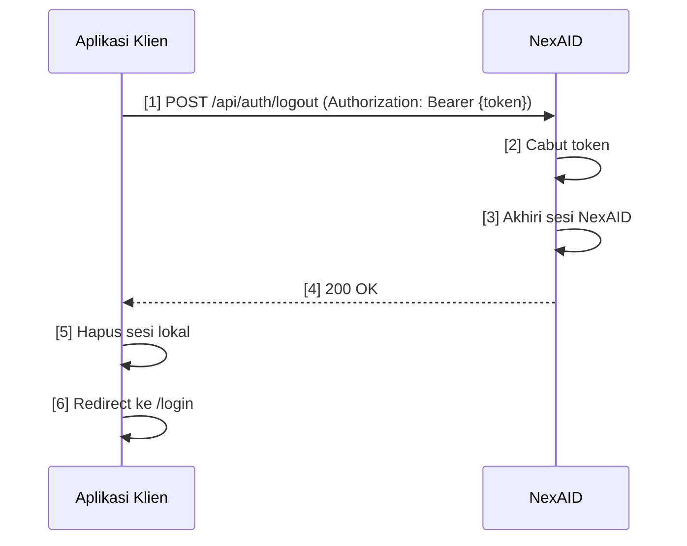

# Logout SSO

Halaman ini menjelaskan cara mengakhiri sesi pengguna di NexAID — baik logout hanya dari satu aplikasi klien (*logout lokal*) maupun logout dari seluruh aplikasi yang terhubung (*logout global*).

---

## Dua Jenis Logout

NexAID mendukung dua pendekatan logout yang perlu dipahami oleh developer:

| | Logout Lokal | Logout Global (SSO Logout) |
|---|---|---|
| **Scope** | Hanya aplikasi klien saat ini | Semua aplikasi klien yang terhubung |
| **Sesi NexAID** | Tetap aktif | Diakhiri |
| **Token** | Sesi lokal dihapus | Token dicabut di NexAID |
| **Pengguna perlu login ulang?** | Tidak (sesi NexAID masih ada) | Ya (harus login lagi di NexAID) |
| **Cocok untuk** | "Keluar dari perangkat ini saja" | "Keluar dari semua perangkat" |

---

## Logout Lokal

**Logout lokal** hanya mengakhiri sesi di aplikasi klien saat ini. Sesi NexAID tetap aktif — pengguna masih dapat mengakses aplikasi klien lain tanpa login ulang.

Implementasi logout lokal cukup dengan **menghapus sesi lokal** di aplikasi klien:

::: code-group

```php [PHP]
// Hapus sesi lokal
session_start();
session_destroy();

// Arahkan ke halaman utama atau halaman login lokal
header("Location: /");
exit;
```

```javascript [Node.js / Express]
app.get('/logout', (req, res) => {
  // Hapus sesi lokal (express-session)
  req.session.destroy((err) => {
    res.clearCookie('connect.sid');
    res.redirect('/');
  });
});
```

```python [Python / Flask]
from flask import session, redirect
from flask_login import logout_user

@app.route('/logout')
def logout():
    session.clear()
    logout_user()
    return redirect('/')
```

:::

::: info Catatan
Dengan logout lokal, jika pengguna membuka aplikasi klien yang sama lagi dan sesi NexAID masih aktif, mereka akan langsung masuk tanpa perlu login. Ini adalah perilaku yang diharapkan untuk SSO.
:::

---

## Logout Global (SSO Logout)

**Logout global** mengakhiri sesi di NexAID dan mencabut token yang aktif. Setelah logout global, pengguna harus login ulang melalui NexAID untuk mengakses aplikasi klien mana pun.

### Endpoint Logout

```http
POST /api/auth/logout
Authorization: Bearer {JWT_TOKEN}
Content-Type: application/json
```

**URL Lengkap:**
```
POST https://nexaid.example.com/api/auth/logout
```

### Contoh Implementasi

::: code-group

```php [PHP]
function nexaidLogout(string $token): bool
{
    $ch = curl_init();
    curl_setopt_array($ch, [
        CURLOPT_URL            => getenv('NEXAID_SSO_URL') . '/api/auth/logout',
        CURLOPT_POST           => true,
        CURLOPT_RETURNTRANSFER => true,
        CURLOPT_HTTPHEADER     => [
            'Authorization: Bearer ' . $token,
            'Content-Type: application/json',
            'Accept: application/json',
        ],
    ]);

    $response = curl_exec($ch);
    $data     = json_decode($response, true);
    curl_close($ch);

    return $data['status'] ?? false;
}

// Panggil saat pengguna logout
$token = $_SESSION['nexaid_token'] ?? null;

if ($token) {
    nexaidLogout($token);
}

// Hapus sesi lokal
session_destroy();
header("Location: /login");
exit;
```

```javascript [Node.js (axios)]
const axios = require('axios');

async function nexaidLogout(token) {
  try {
    const response = await axios.post(
      `${process.env.NEXAID_SSO_URL}/api/auth/logout`,
      {},
      {
        headers: {
          Authorization: `Bearer ${token}`,
          'Content-Type': 'application/json',
        },
      }
    );
    return response.data.status === true;
  } catch (err) {
    console.error('NexAID logout failed:', err.message);
    return false;
  }
}

app.post('/logout', async (req, res) => {
  const token = req.session.nexaidToken;

  if (token) {
    await nexaidLogout(token);
  }

  req.session.destroy();
  res.redirect('/login');
});
```

```python [Python (requests)]
import requests

def nexaid_logout(token):
    try:
        response = requests.post(
            f"{os.getenv('NEXAID_SSO_URL')}/api/auth/logout",
            headers={
                'Authorization': f'Bearer {token}',
                'Content-Type': 'application/json',
            }
        )
        data = response.json()
        return data.get('status') is True
    except Exception as e:
        print(f"NexAID logout failed: {e}")
        return False

@app.route('/logout', methods=['POST'])
def logout():
    token = session.get('nexaid_token')
    if token:
        nexaid_logout(token)
    session.clear()
    return redirect('/login')
```

:::

### Respons Endpoint Logout

**Sukses (`200 OK`):**
```json
{
  "status": true,
  "message": "Logout berhasil. Sesi telah diakhiri."
}
```

**Token tidak valid atau sudah kadaluarsa (`401 Unauthorized`):**
```json
{
  "status": false,
  "message": "Token tidak valid."
}
```

---

## Dampak Logout pada Sesi

### Setelah Logout Lokal

- Sesi lokal di aplikasi klien dihapus.
- Token NexAID **masih aktif**.
- Pengguna masih dapat mengakses aplikasi klien lain tanpa login ulang.
- Jika membuka kembali aplikasi klien yang sama, pengguna langsung masuk (SSO berjalan).

### Setelah Logout Global

- Sesi lokal di aplikasi klien dihapus.
- Token NexAID **dicabut (revoked)**.
- Sesi NexAID **diakhiri**.
- Semua aplikasi klien yang menyimpan token tersebut tidak akan dapat memvalidasinya lagi.
- Pengguna harus login ulang di NexAID untuk mengakses aplikasi mana pun.

::: warning Aplikasi Klien yang Tidak Memanggil Logout Global
Jika aplikasi klien hanya melakukan logout lokal tanpa memanggil endpoint logout NexAID, sesi NexAID pengguna tetap aktif. Ini mungkin diinginkan untuk skenario SSO, tapi bisa menjadi risiko keamanan jika pengguna logout dari perangkat bersama.
:::

---

## Best Practice

### Gunakan Logout Global untuk Lingkungan Sensitif

::: tip
Untuk aplikasi yang memproses data sensitif (keuangan, kesehatan, HR), selalu implementasikan logout global sehingga sesi NexAID juga diakhiri ketika pengguna logout.
:::

### Tangani Kegagalan Logout Global dengan Graceful

::: warning
Jika pemanggilan endpoint logout NexAID gagal (misalnya karena timeout jaringan), **tetap hapus sesi lokal** dan redirect pengguna ke halaman login. Jangan biarkan pengguna terjebak karena error jaringan.
:::

```javascript
// Contoh graceful handling
try {
  await nexaidLogout(token);
} catch (err) {
  // Log error tapi jangan blokir logout lokal
  console.error('SSO logout failed, proceeding with local logout:', err.message);
}

// Selalu hapus sesi lokal, terlepas dari hasil logout NexAID
req.session.destroy();
res.redirect('/login');
```

### Bersihkan Semua Data Sesi

Saat logout, pastikan semua data terkait sesi pengguna dibersihkan:

- [ ] Session/cookie lokal dihapus.
- [ ] Token NexAID yang tersimpan di server dihapus.
- [ ] Cache data pengguna (jika ada) dibersihkan.
- [ ] Pengguna diarahkan ke halaman login, bukan halaman yang memerlukan autentikasi.

### Konfirmasi Sebelum Logout (UX)

Untuk pengalaman pengguna yang lebih baik, tampilkan dialog konfirmasi sebelum melakukan logout global — terutama jika pengguna mungkin memiliki pekerjaan yang belum tersimpan.

---

## Alur Lengkap Logout Global



---

## Lihat Juga

- 🔐 [Alur SSO](./flow) — memahami siklus hidup sesi dari awal hingga akhir.
- 🔑 [Login SSO](./login) — cara memulai alur autentikasi baru setelah logout.
- 🔌 [API Reference](../api/) — dokumentasi lengkap endpoint NexAID.
